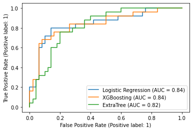
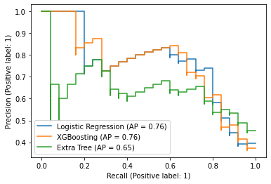

# Chronic Kidney Disease

## [Overview](https://www.kidney.org/news/newsroom/factsheets/KidneyDiseaseBasics#:~:text=1%20in%203%20American%20adults,lived%20with%20a%20kidney%20transplant.)

Chronic kidney disease, or CKD, causes more deaths than breast cancer or prostate cancer. It is the under-recognized public health crisis. It affects an estimated 37 million people in the U.S. (15% of the adult population; more than 1 in 7 adults) and approximately 90% of those with CKD don’t even know they have it. 1 in 3 American adults (approximately 80 million people) is at risk for CKD. CKD is more common in women (15%) than men (12%). CKD is the 9th leading cause of death in the U.S. In 2017, over 500,000 patients received dialysis treatment, and over 200,000 lived with a kidney transplant. The National Kidney Foundation (NKF) has led the way in rallying action on this problem.

Chronic kidney disease (CKD) means your kidneys are damaged and losing their ability to keep you healthy. In the early stages of the disease, most people do not have symptoms. But as CKD gets worse, wastes can build up in your blood and make you feel sick. You may develop other problems like high blood pressure, anemia, weak bones, poor nutritional health, and nerve damage. Because kidneys are vital to so many of the body’s functions, CKD also increases your risk of having heart and blood vessel disease. While these problems may happen slowly and without symptoms, they can lead to kidney failure, which can appear without warning. Once kidneys fail, dialysis or a kidney transplant is needed to stay alive.

__Problem statement__: How might I be able to use a classification machine learning model to build a prediction model of whether a patient will progress in Chronic Kidney Disease staging given the patient's past longitudinal information.

For this challenge, I am given 9 datasets, they are Creatinine, DBP, SBP, Glucose, LDL, HGB, Meds, Stage and Demo. These datasets consist of 300 patients record. 

Creatine, DBP, SBP, Glucose, LDL and HGB datasets are about the reading of each patient at different time.

Meds dataset is about the medications taken by each patient.

Demo dataset is about the patient race, gender and age.

Stage dataset is about the current CKD stage progress of each patient.

## Results

### AUC-ROC Curve

For this problem, I believe that using the Area Under Curve (AUC) as a metric will be an appropriate idea because it focuses on our sensitivity and specificity of our model. To elaborate, AUC measures how true positive rate (recall) and false positive rate trade-off. This reveals how good a model is at distinguishing between positive class and negative class. By analogy, the Higher the AUC, the better the model is at distinguishing whether the patients will progress with CKD or not in the future.

Using an AUC Reciever Operating Characteristic or AUC-ROC curve, __we can visually compare the true positive and false positive rates at a range of different classification thresholds to identify our best model__.

### Precision-Recall Curve

Beyond focusing just on AUC which looks at how good our modelling is at separating our positive and negative class, we also want to pay close attention to our model's ability to classify most or all of our minority class (which in this case is our positive class). 

Using a Precision-Recall curve, we can look at the tradeoff between a classifier’s precision, a measure of result relevancy, and recall, a measure of completeness. Precision is defined as the ratio of true positives to the sum of true and false positives, and recall is the ratio of true positives to the sum of true positives and false negatives.

For diagnostic tests, I think we should first like to know the sensitivity (= recall) because we want to be sure that the test identifies the vast majority of persons with a CKD as having the CKD 

Then we would like to know the positive predictive value (= precision) because precision tells us how sure we can be, when we have a positive result, that the person actually has the CKD. Thus, we know how good the test is at discriminating persons with CKD from those without CKD.

In this case, Logistic Regression and eXtreme Gradient Boosting classifier seems to have similar performance, but it looks like the eXtreme Gradient Boosting classifier slightly edges out. 

Thus, __eXtreme Gradient Boosting classifier is a better model for this problem.__

## Conclusion

I am pleased that my model (eXtreme Gradient Boosting classifier) is able to predicts a relatively high level of AUC (0.83), precision (0.81) and recall (0.68) value.

However, I have some concern about model accuracy because of:
1. Imbalance race, gender and data presented
2. Number of data point per patient per feature is inconsistent

